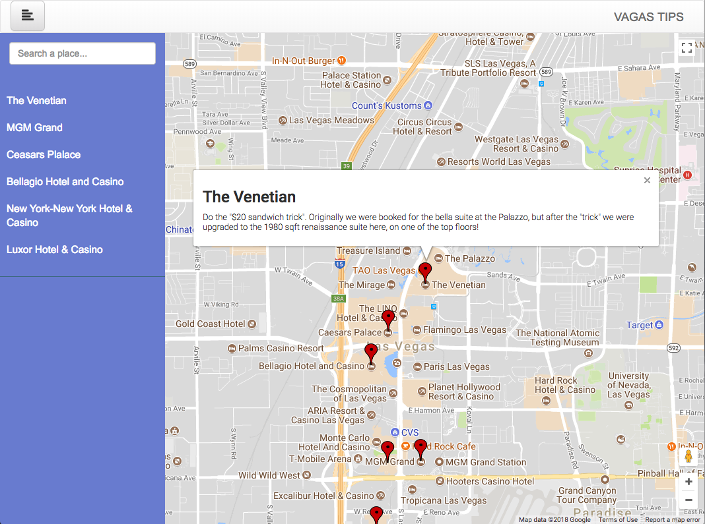

# VegasTips - Neighborhood Map Project
This web app is a interactive map for the hotels and resorts in Las Vegas. It provides travel tips for each place provided by Foursquare.com.

Visit the website: https://allegro-leon-li.github.io/VegasTips/

## Prerequisite
There is no prerequisite for this project. However, some firewall settings may affect the project as the following CDN/APIs will be called:
 * Google Maps API
 * Foursquare API
 * CDN for jQuery
 * CDN for Bootstrap
## Running the project
To run the project, simply download this repository and open the index.html in a browser (Chrome recommended)

## Acknowledgement
The CSS for this project is referred to the template from https://bootstrapious.com/p/bootstrap-sidebar

The structure of this web app is inspired by this post at Udacity Forum: https://discussions.udacity.com/t/how-to-implement-knockout-into-the-project/181122/8
